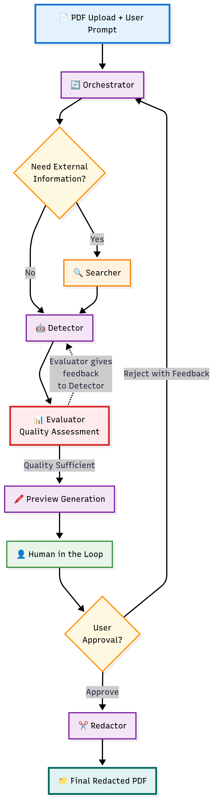
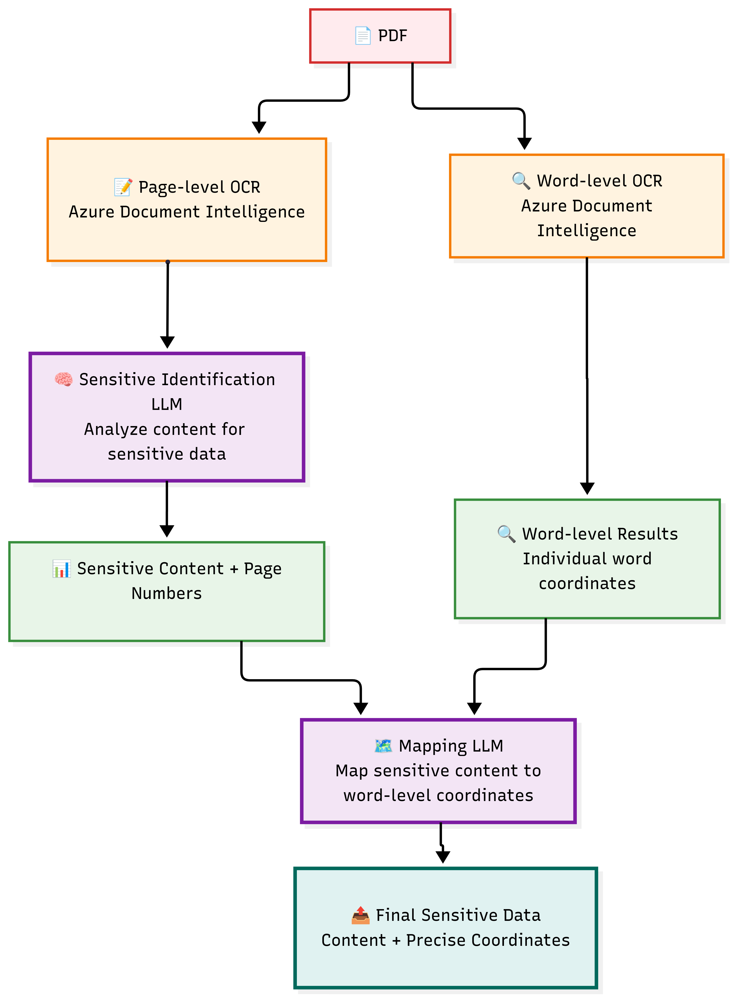
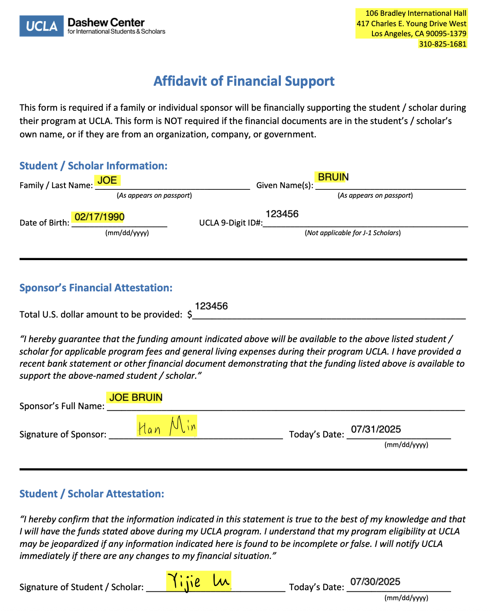

# ✂️🤖 RedactFlow: Agentic PDF Sanitizer

RedactFlow is a powerful and intelligent PDF sanitization tool that uses a sophisticated agentic workflow to detect and redact sensitive information from your documents. It combines state-of-the-art AI models with a human-in-the-loop (HITL) interface to ensure accurate and reliable redaction.

## Overview

The core of RedactFlow is a multi-agent system built with LangGraph that intelligently processes PDF documents to identify and redact sensitive data based on user-defined prompts. The system is designed to be highly accurate and flexible, allowing for both automated and manual redaction to achieve the best results.

## Features

-   **Agentic Workflow:** Utilizes a robust agentic workflow powered by LangGraph to orchestrate the entire sanitization process.
-   **Dual OCR Technology:** Employs a creative dual OCR process for both high-level content understanding and precise word-level coordinate mapping.
-   **Intelligent Detection:** Leverages large language models (LLMs) to analyze document content and identify sensitive information based on user prompts.
-   **Evaluator Feedback Loop:** Includes an evaluator agent that provides feedback to the detector, iteratively improving the accuracy of the detected sensitive data.
-   **Human-in-the-Loop (HITL) Interface:** A user-friendly Streamlit application that allows users to review, edit, and approve the AI-detected redactions, as well as add their own manual redactions.
-   **Flexible and Configurable:** Easily configurable with your own Azure OpenAI and Document Intelligence API keys.

## System Architecture

The RedactFlow system is built around a `langgraph` state machine that orchestrates the flow of data through a series of nodes, each responsible for a specific task in the sanitization process.



The workflow consists of the following key nodes:

-   **Orchestrator:** The entry point of the workflow. It interprets the user's prompt and decides whether to route the request to the `Searcher` for external regulation lookup or directly to the `Detector`.
-   **Searcher:** (Optional) Searches for external regulations and compliance information to enrich the detection criteria.
-   **Detector:** The core of the sensitive data detection process. It uses a dual OCR and dual LLM architecture to identify sensitive information and its precise coordinates in the PDF.
-   **Evaluator:** Reviews the detected sensitive data and provides feedback to the `Detector` to improve accuracy. This creates an iterative feedback loop to refine the detection results.
-   **Human-in-the-Loop (HITL):** Pauses the workflow and waits for the user to review, edit, and approve the redactions through the Streamlit UI.
-   **Redactor:** Applies the final redactions to the PDF, creating a sanitized version of the document.

## The Detector Workflow

The most innovative part of RedactFlow is the **Detector Workflow**. It employs a unique dual OCR and dual LLM architecture to achieve highly accurate and precise sensitive data detection.



Here's how it works:

1.  **Dual OCR in Parallel:**
    -   **Page-level OCR:** A page-level OCR is performed using Azure Document Intelligence to extract the content of the PDF in a readable format. This is used for high-level semantic analysis by the first LLM.
    -   **Word-level OCR:** Simultaneously, a word-level OCR is performed to get the precise coordinates of each individual word in the document.

2.  **Dual LLM Analysis:**
    -   **Sensitive Identification LLM:** The first LLM analyzes the page-level content to identify potential sensitive information based on the user's prompt and any feedback from the `Evaluator`.
    -   **Mapping LLM:** The second LLM takes the sensitive content identified by the first LLM and maps it to the precise word-level coordinates obtained from the word-level OCR. This ensures that the redactions are applied to the exact location of the sensitive data.

This dual approach allows RedactFlow to both understand the context of the document and to pinpoint the exact location of the sensitive information, resulting in highly accurate and reliable redactions.

## Evaluator and Human-in-the-Loop (HITL) Interaction

RedactFlow's architecture is designed to continuously improve its detection accuracy through a sophisticated feedback loop between the `Evaluator` node and the `HumanInLoop` node.

-   **Evaluator Feedback Loop:** After the `Detector` identifies sensitive data, the `Evaluator` node compares the results with the initial user prompt and the overall context of the document. If it finds any discrepancies or potential missed detections, it generates feedback and sends it back to the `Detector`. This iterative process allows the system to self-correct and refine its understanding of what needs to be redacted.

-   **Human-in-the-Loop (HITL):** The HITL interface is a crucial part of the workflow, providing a seamless way for users to interact with the system. Through the Streamlit application, users can:
    -   **Review and Edit AI Detections:** The user can review the sensitive data identified by the AI, edit the content or the bounding boxes, and delete any incorrect detections.
    -   **Add Manual Redactions:** The user can draw their own redaction boxes on the PDF to mark any sensitive information that the AI might have missed.
    -   **Approve or Reject:** The user has the final say. They can either approve the redactions, which sends the document to the `Redactor` node, or reject them, which sends the workflow back to the `Orchestrator` with additional feedback.

This powerful combination of an automated feedback loop and human oversight ensures that the final redacted document is accurate, reliable, and meets the user's specific needs.

## Preview before and after user's feedback



Give a user prompt: You failed to detect the UID and financial amount. Also, include the date.


The Final Redacted Version is below:


## How to Use

### Prerequisites

-   Python 3.8+
-   An Azure account with access to Azure OpenAI and Azure Document Intelligence.

### Installation

1.  **Clone the repository:**
    ```bash
    git clone https://github.com/matthewyijielu0317/RedactFlow.git
    cd RedactFlow
    ```

2.  **Create a virtual environment and install dependencies:**
    ```bash
    python3 -m venv venv
    source venv/bin/activate
    pip install -r requirements.txt
    ```

### Configuration

1.  **Create a `.env` file:**
    Copy the `.env.example` file to a new file named `.env`:
    ```bash
    cp .env.example .env
    ```

2.  **Add your credentials to the `.env` file:**
    Open the `.env` file and add your Azure OpenAI and Azure Document Intelligence credentials:
    ```
    AZURE_OPENAI_ENDPOINT=
    AZURE_DI_ENDPOINT=
    AZURE_DI_KEY=
    AZURE_OPENAI_API_KEY=
    TAVILY_KEY=
    ```

### Running the Application

Once you have completed the installation and configuration steps, you can run the Streamlit application:

```bash
streamlit run app.py
```

This will open the RedactFlow application in your web browser.

## File Descriptions

-   **`app.py`**: The main entry point of the application. This script runs the Streamlit UI for the human-in-the-loop interface.
-   **`requirements.txt`**: A list of all the Python dependencies required for this project.
-   **`.env.example`**: An example file for the environment variables.
-   **`nodes/`**: This directory contains the core logic of the agentic workflow, with each file representing a node in the `langgraph` state machine.
    -   **`__init__.py`**: Initializes the `nodes` module.
    -   **`orchestrator.py`**: Defines the main `langgraph` workflow and the orchestrator node.
    -   **`detector_node.py`**: Implements the dual OCR and dual LLM detector workflow.
    -   **`evaluator_node.py`**: Implements the evaluator agent that provides feedback to the detector.
    -   **`hitl_node.py`**: Implements the human-in-the-loop logic.
    -   **`manual_redactor_node.py`**: Handles the application of manual redactions.
    -   **`model.py`**: A wrapper for the Azure OpenAI LLM.
    -   **`redactor_node.py`**: Applies the final redactions to the PDF.
    -   **`searcher_node.py`**: (Optional) Implements the search agent for external regulation lookup.
    -   **`state.py`**: Defines the shared state object for the `langgraph` workflow.
-   **`diagrams/`**: Contains the diagrams used in this README file.
-   **`output/`**: This directory is created automatically to store the original, preview, and redacted PDF files.
